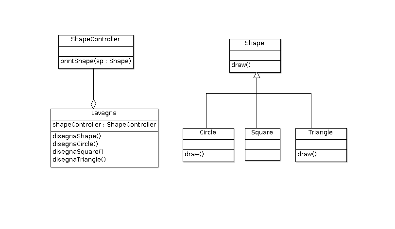

# ESEMPIO Overridding - Polimorfismo

Le sottoclasse `Circle` e `Triangle` fanno un override del metodo `draw()` della superclasse `Shape`. Il metodo `printShape(Shape sp)` della classe `ShapeController` sfrutta il polimorfismo: all'interno del metodo viene invocato `sp.draw()` sull'oggetto di tipo `Shape`.

Vedi anche [client/TestSubstitution.java](./src/client/TestSubstitution.java) per evidenziare differenze *uppercast* e *downcast* (cast espicito).

## ESERCIZIO
1. Aggiungere una nuove sottoclasse di `Shape`, `Elipse` e vedere cosa cambia;
1. Fai diventare `Shape` una **interface** e vedi le differenze;
1. Scrivere la versione si `ShapeController` con l'overloading del metodo `print` vedere le differenze in caso si voglia aggiungere una sottoclasse di `Shape`;

